# Boom Bot

A Telegram bot that provides boom counts and plays Craps.

## Features

*   `/boom`: Sends a random number (1-5) of 💥 emojis.
*   `/boom <number>`: Sends the specified number (1-5) of 💥 emojis.
*   `/boom <number > 5>`: Sends a sassy reply.
*   `/boom <number < 1>`: Sends a different sassy reply.
*   `/boom <non-number>`: Sends a sassy reply about needing a number.
*   `/howmanybooms <question>`: Asks the bot how many booms something deserves (e.g., `/howmanybooms does my cat deserve`). The bot remembers questions and provides consistent (randomly assigned) answers using NLTK for fuzzy matching.
*   Sending a photo with `/howmanybooms <question>` in the caption: Same as the text command, but triggered by a photo caption.
*   `/whowouldwin <contenders>`: Asks an LLM to call a hypothetical fight (e.g. `/whowouldwin lions vs tigers`, `/whowouldwin between 100 men and one gorilla`). Requires `LLM_API_KEY` (see below).
*   **Craps Game (Multi-Channel & Multi-Player):**
    *   `/roll`: Rolls the dice for the current channel's Craps game. Resolves bets for all players in the channel.
    *   `/bet <type> <amount>`: Places a bet for the user in the current channel. Valid types include `pass_line`, `dont_pass`, `field`, `place_4`, `place_5`, `place_6`, `place_8`, `place_9`, `place_10`. (e.g., `/bet pass_line 10`, `/bet place 6 12`).
    *   `/showgame`: Displays the current channel's game state (Point, Phase) and the user's current balance and active bets.
    *   `/resetmygame`: Resets the user's balance to the starting amount ($100) and clears their bets within the current channel.
    *   `/crapshelp`: Shows detailed rules and commands for the Craps game.
*   **Chess Challenge (community vs Stockfish):**
    *   `/newgame`: Select a difficulty and start a chat-scoped game.
    *   Reply to the latest board image with SAN such as `e4`, `Nf3`, `O-O`, or
        use `/move e4`.
    *   The bot validates the move, replies with Stockfish's move and a
        rendered board, and records every move durably in SQLite.
    *   The options menu supports resigning or agreeing to a draw.
    *   Completed games are replayed by a background analysis queue and user
        moves receive a best-move score.
*   **Enterprise Casino Microkernel (unified, event-sourced wallet):**
    *   One persistent wallet per player shared across all games. State is
        stored as an append-only domain-event stream (SQLite by default,
        switchable to JSON).
    *   `/wallet`: Show your unified balance, free spins, and cumulative stats.
    *   `/leaderboard`: Show the top players ranked by balance.
    *   `/resetwallet`: Restore your balance to the starting amount.
    *   `/roulette <type> [number] <amount>`: Place a roulette wager, e.g.
        `/roulette red 10`, `/roulette straight 7 10`.
    *   `/roulettespin`: Spin the wheel and settle this chat's roulette wagers.
    *   `/craps <type> <amount>`: Place a craps wager, e.g.
        `/craps pass_line 10`, `/craps any_seven 5`.
    *   `/crapsroll`: Roll the dice and settle this chat's craps wagers.
    *   `/zeus`: Spin the persistent Zeus 5x5 reel family (10 per spin, free
        spins earned on four/five-of-a-kind and jackpots).
    *   Every game outcome — the roulette pocket, the craps dice, the Zeus reel
        grid — is a *decision* rendered by the **JVM Decision Engine**, which
        delegates the pure atomic randomness down to Rust. See
        [JVM Decision Engine](#jvm-decision-engine).

## Enterprise Casino Architecture

The casino is built as a ports-and-adapters microkernel around a single
event-sourced wallet aggregate. Telegram is only an adapter: commands enter
through the CQRS buses, cross-cutting concerns run in a composable middleware
pipeline, and the application service coordinates domain rules without
knowing which event-store adapter is configured. The read side is a reactive
projection, so leaderboard queries never rebuild wallets from the write model.

```mermaid
classDiagram
    direction LR

    namespace Presentation {
        class CasinoTelegramFacade {
            +wallet_command()
            +leaderboard_command()
            +roulette_command()
            +craps_command()
            +zeus_command()
        }
    }

    namespace Composition {
        class DependencyContainer {
            +register()
            +register_instance()
            +resolve()
            +shutdown()
        }
    }

    namespace CQRS {
        class ICommandBus {
            <<interface>>
            +dispatch(command)
        }

        class CommandBus {
            +register_handler()
            +add_middleware()
            +dispatch(command)
        }

        class IQueryBus {
            <<interface>>
            +dispatch(query)
        }

        class QueryBus {
            +register_handler()
            +dispatch(query)
        }

        class ICommandHandler {
            <<interface>>
            +handle(command)
        }

        class IQueryHandler {
            <<interface>>
            +handle(query)
        }

        class AbstractCommand {
            <<abstract>>
            +assign_command_id()
        }

        class AbstractQuery {
            <<abstract>>
        }

        class AbstractWageringCommand {
            +get_user_id()
            +get_tenant_id()
            +get_game()
        }

        class AbstractWageringCommandHandler {
            <<abstract>>
            +handle(command)
        }

        class PlaceRouletteBetCommand
        class SpinRouletteCommand
        class PlaceCrapsBetCommand
        class RollCrapsCommand
        class SpinZeusCommand
        class ResetWalletCommand

        class PlaceRouletteBetCommandHandler
        class SpinRouletteCommandHandler
        class PlaceCrapsBetCommandHandler
        class RollCrapsCommandHandler
        class SpinZeusCommandHandler
        class ResetWalletCommandHandler

        class GetWalletBalanceQuery
        class GetWalletStatsQuery
        class GetLeaderboardQuery
        class GetWalletBalanceQueryHandler
        class GetWalletStatsQueryHandler
        class GetLeaderboardQueryHandler
    }

    namespace Application {
        class WageringApplicationService {
            +get_wallet()
            +place_roulette_bet()
            +spin_roulette()
            +place_craps_bet()
            +roll_craps()
            +spin_zeus()
            +reset_wallet()
        }

        class PipelineMiddleware {
            <<interface>>
            +handle(command, next)
        }

        class AbstractCommandContextMiddleware {
            <<abstract>>
            +before_command()
            +after_command()
        }

        class AuditTrailMiddleware
        class IdempotencyMiddleware
        class RetryMiddleware
        class TenantBindingMiddleware
    }

    namespace Domain {
        class AbstractIdentifiable {
            <<abstract>>
            +get_identity()
        }

        class AbstractEntity {
            <<abstract>>
        }

        class AbstractAuditableEntity {
            <<abstract>>
            +mark_modified()
        }

        class AbstractVersionedEntity {
            <<abstract>>
            +get_version()
            +assert_version_matches()
        }

        class AbstractAggregateRoot {
            <<abstract>>
            +to_state_dictionary()
            +from_state_dictionary()
        }

        class AbstractEventSourcedAggregate {
            <<abstract>>
            +raise_event()
            +replay()
            +commit()
        }

        class Wallet {
            +provision()
            +debit()
            +credit()
            +record_wager()
            +reset()
            +award_free_spins()
        }

        class AbstractValueObject {
            <<abstract>>
        }

        class Money {
            +add()
            +subtract()
            +formatted()
        }

        class AggregateVersion {
            +number()
            +next()
        }

        class RoulettePayoutStrategy {
            +calculate_winnings()
        }

        class CrapsBetValidationStrategy {
            +validate()
        }

        class CrapsPayoutStrategy {
            +calculate()
        }

        class CrapsPushStrategy {
            +is_push()
        }

        class RandomGridFactory {
            +generate()
        }

        class LineEvaluationStrategy {
            +evaluate()
        }

        class PayoutCalculator {
            +calculate()
        }
    }

    namespace Events {
        class AbstractDomainEvent {
            <<abstract>>
            +event_type()
            +to_dictionary()
        }

        class AbstractWalletEvent {
            <<abstract>>
        }

        class WalletCreatedEvent
        class FundsDebitedEvent
        class FundsCreditedEvent
        class WalletResetEvent
        class FreeSpinAwardedEvent
        class FreeSpinRedeemedEvent
        class WageredRecordedEvent

        class EventTypeRegistry {
            +register()
            +resolve()
        }
    }

    namespace Persistence {
        class IEventStore {
            <<interface>>
            +append()
            +load()
            +load_all_events()
            +save_snapshot()
        }

        class SqliteEventStoreAdapter {
            +append()
            +load()
            +save_snapshot()
        }

        class JsonEventStoreAdapter {
            +append()
            +load()
            +save_snapshot()
        }

        class SnapshotPolicy {
            +should_take_snapshot()
        }

        class WalletRepository {
            +find()
            +load_or_provision()
            +save()
        }

        class IGameSessionStore {
            <<interface>>
            +get_channel_session()
            +save_channel_session()
        }

        class InMemoryGameSessionStore {
            +get_channel_session()
            +save_channel_session()
        }
    }

    namespace EventsAndReadModel {
        class IEventBus {
            <<interface>>
            +publish(event)
            +subscribe(observer, event_type)
        }

        class IGameObserver {
            <<interface>>
            +notify(event)
        }

        class InProcessEventBus {
            +publish(event)
            +subscribe(observer, event_type)
        }

        class LeaderboardProjection {
            +register_name()
            +notify(event)
            +get_leaderboard()
        }

        class PlayerStanding {
            +get_balance()
            +get_total_won()
            +get_total_wagered()
        }

        class LeaderboardSnapshot {
            +get_rankings()
            +get_size()
        }
    }

    namespace MultiTenancy {
        class TenantId {
            +value()
        }

        class TenantContext {
            +set_current()
            +require_current()
        }

        class ITenantResolver {
            <<interface>>
            +resolve(chat_identifier)
        }

        class ChatIdentifierTenantResolver {
            +resolve(chat_identifier)
        }
    }

    %% Composition root and presentation boundary.
    CasinoTelegramFacade --> DependencyContainer : resolves
    CasinoTelegramFacade --> CommandBus : dispatches commands
    CasinoTelegramFacade --> QueryBus : dispatches queries
    CasinoTelegramFacade --> LeaderboardProjection : registers identity
    DependencyContainer ..> CommandBus : composes
    DependencyContainer ..> QueryBus : composes
    DependencyContainer ..> WageringApplicationService : injects
    DependencyContainer ..> IEventStore : selects adapter
    DependencyContainer ..> IEventBus : wires observer

    %% CQRS write side and command pipeline.
    ICommandBus <|.. CommandBus
    IQueryBus <|.. QueryBus
    CommandBus --> ICommandHandler : resolves
    CommandBus o-- PipelineMiddleware : composes
    PipelineMiddleware <|-- AbstractCommandContextMiddleware
    AbstractCommandContextMiddleware <|-- AuditTrailMiddleware
    AbstractCommandContextMiddleware <|-- IdempotencyMiddleware
    AbstractCommandContextMiddleware <|-- RetryMiddleware
    AbstractCommandContextMiddleware <|-- TenantBindingMiddleware
    ICommandHandler <|.. AbstractWageringCommandHandler
    AbstractWageringCommandHandler <|-- PlaceRouletteBetCommandHandler
    AbstractWageringCommandHandler <|-- SpinRouletteCommandHandler
    AbstractWageringCommandHandler <|-- PlaceCrapsBetCommandHandler
    AbstractWageringCommandHandler <|-- RollCrapsCommandHandler
    AbstractWageringCommandHandler <|-- SpinZeusCommandHandler
    AbstractWageringCommandHandler <|-- ResetWalletCommandHandler
    AbstractCommand <|-- AbstractWageringCommand
    AbstractWageringCommand <|-- PlaceRouletteBetCommand
    AbstractWageringCommand <|-- SpinRouletteCommand
    AbstractWageringCommand <|-- PlaceCrapsBetCommand
    AbstractWageringCommand <|-- RollCrapsCommand
    AbstractWageringCommand <|-- SpinZeusCommand
    AbstractWageringCommand <|-- ResetWalletCommand
    PlaceRouletteBetCommand --> PlaceRouletteBetCommandHandler : routes to
    SpinRouletteCommand --> SpinRouletteCommandHandler : routes to
    PlaceCrapsBetCommand --> PlaceCrapsBetCommandHandler : routes to
    RollCrapsCommand --> RollCrapsCommandHandler : routes to
    SpinZeusCommand --> SpinZeusCommandHandler : routes to
    ResetWalletCommand --> ResetWalletCommandHandler : routes to
    AbstractWageringCommandHandler --> WageringApplicationService : delegates

    %% CQRS read side.
    AbstractQuery <|-- GetWalletBalanceQuery
    AbstractQuery <|-- GetWalletStatsQuery
    AbstractQuery <|-- GetLeaderboardQuery
    IQueryHandler <|.. GetWalletBalanceQueryHandler
    IQueryHandler <|.. GetWalletStatsQueryHandler
    IQueryHandler <|.. GetLeaderboardQueryHandler
    QueryBus --> IQueryHandler : resolves
    GetWalletBalanceQuery --> GetWalletBalanceQueryHandler : routes to
    GetWalletStatsQuery --> GetWalletStatsQueryHandler : routes to
    GetLeaderboardQuery --> GetLeaderboardQueryHandler : routes to
    GetWalletBalanceQueryHandler --> WageringApplicationService : reads
    GetWalletStatsQueryHandler --> WageringApplicationService : reads
    GetLeaderboardQueryHandler --> LeaderboardProjection : reads

    %% Domain model and event-sourcing lifecycle.
    AbstractIdentifiable <|-- AbstractEntity
    AbstractEntity <|-- AbstractAuditableEntity
    AbstractAuditableEntity <|-- AbstractVersionedEntity
    AbstractVersionedEntity <|-- AbstractAggregateRoot
    AbstractAggregateRoot <|-- AbstractEventSourcedAggregate
    AbstractEventSourcedAggregate <|-- Wallet
    AbstractValueObject <|-- Money
    AbstractValueObject <|-- AggregateVersion
    Wallet --> Money : protects balance
    Wallet --> AggregateVersion : optimistic version
    Wallet --> AbstractWalletEvent : raises and applies
    WageringApplicationService --> WalletRepository : loads and saves
    WageringApplicationService --> IGameSessionStore : tenant-scoped wagers
    WageringApplicationService --> RoulettePayoutStrategy : applies rules
    WageringApplicationService --> CrapsBetValidationStrategy : validates rules
    WageringApplicationService --> CrapsPayoutStrategy : applies rules
    WageringApplicationService --> CrapsPushStrategy : resolves pushes
    WageringApplicationService --> RandomGridFactory : creates Zeus grids
    WageringApplicationService --> LineEvaluationStrategy : evaluates paylines
    WageringApplicationService --> PayoutCalculator : calculates rewards

    %% Event stream, snapshots, and pluggable persistence.
    AbstractDomainEvent <|-- AbstractWalletEvent
    AbstractWalletEvent <|-- WalletCreatedEvent
    AbstractWalletEvent <|-- FundsDebitedEvent
    AbstractWalletEvent <|-- FundsCreditedEvent
    AbstractWalletEvent <|-- WalletResetEvent
    AbstractWalletEvent <|-- FreeSpinAwardedEvent
    AbstractWalletEvent <|-- FreeSpinRedeemedEvent
    AbstractWalletEvent <|-- WageredRecordedEvent
    EventTypeRegistry --> AbstractDomainEvent : rehydrates
    IEventStore <|.. SqliteEventStoreAdapter
    IEventStore <|.. JsonEventStoreAdapter
    SqliteEventStoreAdapter --> EventTypeRegistry : deserializes
    JsonEventStoreAdapter --> EventTypeRegistry : deserializes
    WalletRepository --> IEventStore : appends stream
    WalletRepository --> SnapshotPolicy : bounds replay cost
    WalletRepository --> Wallet : reconstitutes aggregate

    %% Event publication and denormalized read model.
    IEventBus <|.. InProcessEventBus
    IGameObserver <|.. LeaderboardProjection
    InProcessEventBus o-- IGameObserver : notifies
    WageringApplicationService --> IEventBus : publishes committed events
    LeaderboardProjection --> AbstractDomainEvent : projects
    LeaderboardProjection o-- PlayerStanding : maintains read model
    LeaderboardProjection --> LeaderboardSnapshot : returns
    LeaderboardSnapshot o-- PlayerStanding : ranks

    %% Tenant isolation and per-chat session state.
    IGameSessionStore <|.. InMemoryGameSessionStore
    ITenantResolver <|.. ChatIdentifierTenantResolver
    ChatIdentifierTenantResolver --> TenantId : creates
    TenantBindingMiddleware --> TenantContext : binds
    TenantContext o-- TenantId : holds current tenant

```



The diagram’s namespaces show the platform boundaries, while solid inheritance
lines show substitutable abstractions and dashed dependency lines show
composition-time wiring. The event path makes the write/read separation
explicit: `Wallet` emits immutable events, the selected event store persists
them, and `LeaderboardProjection` builds a fast read model from the same
stream.

## Running the Bot

1.  **Clone the repository (or download the files):**
    ```bash
    git clone <repository_url> # Or download ZIP
    cd boom-bot
    ```

2.  **Create a virtual environment (recommended):**
    ```bash
    python -m venv venv
    # On Windows
    .\venv\Scripts\activate
    # On macOS/Linux
    source venv/bin/activate
    ```

3.  **Install dependencies:**
    ```bash
    pip install -r requirements.txt
    ```
    *(Note: This will also download necessary NLTK data on first run if not present.)*

4.  **Get a Telegram Bot Token:**
    *   Talk to [@BotFather](https://t.me/BotFather) on Telegram.
    *   Create a new bot using `/newbot`.
    *   Copy the token BotFather gives you.

5.  **Create a `.env` file:**
    *   Create a file named `.env` in the `boom-bot` directory.
    *   Add the following line, replacing `YOUR_TOKEN_HERE` with the token you got from BotFather:
      ```
      TELEGRAM_BOT_TOKEN=YOUR_TOKEN_HERE
      ```

6.  **Run the bot:**
    ```bash
    python bot.py
    ```

## LLM Configuration (`/whowouldwin`)

`/whowouldwin` calls [OpenRouter](https://openrouter.ai). Set these in `.env`:

| Variable | Required | Default | Purpose |
| --- | --- | --- | --- |
| `LLM_API_KEY` | yes | – | OpenRouter API key. Without it the command replies that it isn't configured. |
| `LLM_MODELS` | no | `openrouter/free` | Comma separated model chain, tried in order until one answers. |
| `LLM_MODEL` | no | – | Shorthand for pinning a single model (ignored if `LLM_MODELS` is set). |
| `LLM_FOLLOW_MODEL_HINTS` | no | `false` | When a 404 names a replacement slug, retry it. Off by default — the replacement is normally the paid model. |
| `LLM_TIMEOUT` | no | `30` | Per-request timeout in seconds. |
| `LLM_REFERER` / `LLM_APP_NAME` | no | – / `boom-bot` | Optional OpenRouter attribution headers. |

The default is [`openrouter/free`](https://openrouter.ai/openrouter/free),
OpenRouter's free-models router: it picks a currently available free model that
can serve the request. Pinning individual `:free` slugs is what used to break
this command — they get rate limited and retired without notice, and OpenRouter
has been moving them to paid — so let the router absorb that churn instead.
Free usage is capped at 20 requests/minute and 1,000/day (50/day until you have
ever added $10 in credits).

`LLM_MODELS` still takes a chain if you want to pin specific models: they are
tried in order until one answers, and when they all fail the reason is logged at
`WARNING` with the HTTP status and OpenRouter's error message. Two 404s are
worth recognising in those logs:

- `This model is unavailable for free ... use this slug instead: <slug>` — the
  model moved to paid. Set `LLM_FOLLOW_MODEL_HINTS=true` to have the bot retry
  the named slug automatically; it is off by default because that slug bills
  your credits. Either way the suggestion is logged.
- `No endpoints found for <model>` — the slug exists but no provider will serve
  it for your account. Usually credits or the data policy at
  <https://openrouter.ai/settings/privacy>, not something a config change fixes.

The bot should now be running and connected to Telegram.

## JVM Decision Engine

Game outcomes are decisions, and decisions belong to the **JVM Decision Engine**
(`decision-engine/`). The wagering application service builds a `DecisionRequest`
and routes it through a decision fabric:

```
Python application service
        │  DecisionRequest {kind, seed, tenant}
        ▼
JVM Decision Engine  ────────────────  Java middleware
        │                                 (rules + strategy live here)
        │  spawns atomic_cli
        ▼
Rust Atomic Logic  ───────────────────  PURE atomic logic
                                               splitmix64 + uniform primitives
```

The fabric is wired through the DI container (`DECISION_ENGINE_MODE`). When the
JVM engine is present it is engaged — production spins delegate down to it, and
it in turn delegates the raw randomness to the compiled Rust binary. When the
engine is absent the fabric degrades to an in-process reference provider that
produces the same uniform distribution.

| Variable | Default | Purpose |
| --- | --- | --- |
| `DECISION_ENGINE_MODE` | `auto` | `auto`, `jvm`, or `reference`. |
| `DECISION_ENGINE_JAR` | `<repo>/decision-engine/build/jvm-decision-engine.jar` | JVM engine jar path. |
| `DECISION_ENGINE_RUST_BIN` | `<repo>/decision-engine/build/atomic_cli` | Rust atomic-logic binary path. |
| `DECISION_ENGINE_TIMEOUT_SECONDS` | `5` | Per-decision child-process timeout. |

Build it (requires a JDK 17+ and, for the Rust path, `cargo`):

```bash
cd decision-engine && ./build.sh
```

The Docker image ships the toolchain and builds the engine as part of its image,
so `mode=auto` engages it in production automatically.

## Enterprise Casino configuration

The casino is an event-sourced, CQRS subsystem with a single persistent wallet
per player shared across Roulette, Craps, and Zeus. Player state is stored as
an append-only domain-event stream and reconstructed on demand; a leaderboard
read model is maintained reactively from published events.

| Variable | Default | Purpose |
| --- | --- | --- |
| `CASINO_STORAGE` | `sqlite` | Backing event store: `sqlite` or `json`. |
| `CASINO_EVENT_STORE_SQLITE` | `<DATA_DIR>/casino.sqlite3` | SQLite event store path. |
| `CASINO_EVENT_STORE_JSON` | `<DATA_DIR>/casino_events.json` | JSON event log path when `CASINO_STORAGE=json`. |
| `CASINO_SNAPSHOT_THRESHOLD` | `50` | Events per aggregate before a compaction snapshot. |
| `CASINO_STARTING_BALANCE` | `100.00` | Initial wallet balance for new players. |
| `ZEUS_SPIN_COST` | `10.00` | Cost of a paid Zeus spin. |

On Fly the event store lives under the persistent `/data` volume via
`BOT_DATA_DIR`, alongside the chess SQLite database.

## Chess Challenge configuration

The chess feature runs in the same Python process as the existing bot. It uses
the native `stockfish` executable, `python-chess` for legal move handling, and
SQLite for durable users, games, moves, and post-game analysis. The default
data directory is `./data` for local development. On Fly, `fly.toml` sets both
`BOT_DATA_DIR` and `CHESS_DATABASE_PATH` to `/data`, which is the mounted
persistent volume. Set either variable to override those locations.

The Stockfish process is started lazily on the first game request. Configure
its strength with `STOCKFISH_HASH_MB`, `STOCKFISH_THREADS`, and
`STOCKFISH_DEPTH`. `STOCKFISH_GAME_DEPTH` and `STOCKFISH_ANALYSIS_DEPTH` can
override live-game and post-game analysis depth independently. The defaults
use one thread, a 64 MB hash, depth 12, and a 15-second analysis interval so
the bot remains within a small shared VM's memory budget.

Chess interactions carry a request ID through the Telegram handler, game
service, SQLite repository, board renderer, Stockfish process, and background
analysis logs. If a chess interaction fails, the initiating Telegram user
receives the user-facing error plus a complete request-scoped `.log` document
only when that user is present in the `CHESS_ERROR_LOG_USER_IDS` comma-separated
runtime secret. The report includes
the captured INFO/DEBUG trail, exception traceback, engine command/output
tail, database operation boundary, game/FEN state, and timing without
including the bot token. Background analysis failures remain in the normal
application logs because there is no initiating Telegram message to reply to.

The deployment workflow forwards the repository secret named
`CHESS_ERROR_LOG_USER_IDS` to Fly.io. Leave it unset to disable Telegram
diagnostic attachments while retaining normal application logging.

### Fly.io deployment

The included Fly configuration pins one `shared-cpu-1x` Machine with 1 GB of
RAM, one Stockfish thread, and the persistent `/data` volume. The Machine runs
two services via `start.sh`: the Telegram bot (long polling) and the MMO game
service, whose browser client is served at `https://<app>.fly.dev`. The MMO
writes its world state to `/data/mmo.sqlite3` and appends wallet events to the
same `/data/casino.sqlite3` store the casino microkernel uses.

Keep this as a single Machine because SQLite volumes attach to one Machine;
scaling out would require an external database or a replication layer.

For a new app, create the volume in the app's primary region and deploy:

```sh
fly volumes create bot_data --region iad --size 1
fly deploy
```

Skip volume creation if `bot_data` already exists. Fly's legacy free allowance
is limited to qualifying older organizations; new organizations should expect
usage-based billing. See [Fly pricing](https://fly.io/docs/about/pricing/),
[Machine configuration](https://fly.io/docs/reference/configuration/), and
[volume behavior](https://fly.io/docs/volumes/overview/) before changing the
resource profile.
