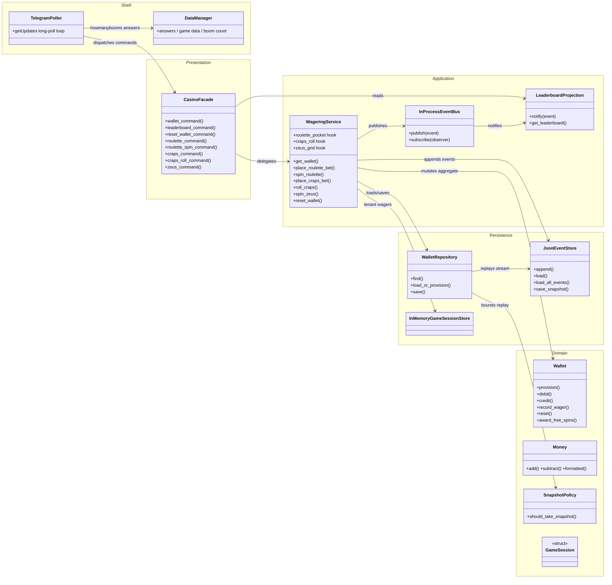

# Boom Bot

A Telegram bot that provides boom counts and runs an enterprise casino.

Since the C++20 rewrite the bot is a **standalone C++20 binary** (`bot-cpp/`)
built with nothing but `g++` — JSON, money, HTTP (via a `curl` subprocess), the
Telegram client, NLTK-style fuzzy matching, and the LLM client are all
implemented in `bot-cpp/src/`. The Python implementation was retired in the
port; the only Python that remains is the **Chess Challenge engine**
(`boombot/games/chess`), which the C++ bot ignores until it is ported.

## Features

*   `/boom`: Sends a random number (1-5) of 💥 emojis.
*   `/boom <number>`: Sends the specified number (1-5) of 💥 emojis.
*   `/boom <number > 5>`: Sends a sassy reply.
*   `/boom <number < 1>`: Sends a different sassy reply.
*   `/boom <non-number>`: Sends a sassy reply about needing a number.
*   `/howmanybooms <question>`: Asks the bot how many booms something deserves
    (e.g., `/howmanybooms does my cat deserve`). The bot remembers questions
    and provides consistent (randomly assigned) answers using fuzzy matching
    (NLTK logic ported to `bot-cpp/src/bb_nltk.cpp`).
*   Sending a photo with `/howmanybooms <question>` in the caption: Same as the
    text command, but triggered by a photo caption.
*   `/whowouldwin <contenders>`: Asks an LLM to call a hypothetical fight
    (e.g. `/whowouldwin lions vs tigers`, `/whowouldwin between 100 men and
    one gorilla`). Requires `LLM_API_KEY` (see below).
*   `/friggedthedeposit <name>`: Asks the LLM for a humorous story about how
    the named person frigged the deposit (e.g. `/friggedthedeposit Kevin`).
*   **Enterprise Casino (unified, event-sourced wallet):**
    *   One persistent wallet per player across all games. State is stored as
        an append-only domain-event stream (JSON Lines with per-aggregate
        snapshots).
    *   `/wallet`: Show your unified balance, free spins, and cumulative stats.
    *   `/leaderboard`: Show the top players ranked by balance.
    *   `/resetwallet`: Restore your balance to the starting amount.
    *   `/roulette <type> [number] <amount>`: Place a roulette wager, e.g.
        `/roulette red 10`, `/roulette straight 7 10`.
    *   `/roulettespin`: Spin the wheel and settle this chat's roulette wagers.
    *   `/craps <type> <amount>`: Place a craps wager, e.g.
        `/craps pass_line 10`, `/craps any_seven 5`.
    *   `/crapsroll`: Roll the dice and settle this chat's craps wagers.
    *   `/zeus`: Spin the persistent Zeus reel family (four/five-of-a-kind
        earn free spins, jackpots pay 5,000 coins; replies use MarkdownV2).
*   **Chess Challenge (community vs Stockfish):** the Python engine
    (`boombot/games/chess`) is retained but not yet wired into the C++ bot;
    chess commands are ignored for now. See
    [Chess Challenge configuration](#chess-challenge-configuration-python).

The legacy multi-channel Python games (`/roll`, `/bet`, `/showgame`,
`/resetmygame`, `/crapshelp` and the standalone roulette/Zeus handlers) were
removed with the Python retirement; the casino wagering commands above are
their unified replacement.

## Repository layout

| Path | What it is |
| --- | --- |
| `bot-cpp/` | The Telegram bot: C++20 sources, headers, self-tests, `build.sh` |
| `boombot/games/chess` | Chess Challenge engine (Python, not yet ported) |
| `decision-engine/` | JVM Decision Engine (Java middleware + Rust atomic logic) |
| `wagering-service/` | Standalone C wallet service (encrypted event logs, sponsorship) |
| `mmo-server/` | Persistent browser MMO (Java service + Three.js client) |
| `tests/` | Python integration tests for the C wagering service and the MMO (the C++20 bot's own suite lives in `bot-cpp/tests`, 751 checks) |
| `data/` | Runtime state: casino event log, chess DB, MMO world DB |

## Building

The bot builds with a bare `g++` toolchain — no external libraries. You need a
C++20-capable compiler (g++ 12 or newer) and `curl` at runtime. There is no
`make`; `build.sh` invokes the compiler directly:

```bash
cd bot-cpp
./build.sh            # produces build/boombot and build/boombot-tests
./build/boombot-tests # self-tests: 751 checks, 0 failures
```

JSON (dom/existential), money (fixed-point cents), regex, NLTK-style fuzzy
matching, the OpenRouter client, the Telegram long-polling client, the
event-sourced wallet store, and the casino application service are all
implemented in `bot-cpp/src/` (`bb_*.cpp`).

## Running the Bot

1.  **Clone the repository:**
    ```bash
    git clone <repository_url>
    cd boom-bot
    ```

2.  **Get a Telegram Bot Token:**
    *   Talk to [@BotFather](https://t.me/BotFather) on Telegram.
    *   Create a new bot using `/newbot`.
    *   Copy the token BotFather gives you.

3.  **Set the token** (the bot reads the environment directly, or a `.env`
    via your shell):
    ```bash
    export TELEGRAM_TOKEN=YOUR_TOKEN_HERE
    ```

4.  **Build and run the bot:**
    ```bash
    ./bot-cpp/build.sh
    ./bot-cpp/build/boombot
    ```

    Optional: on Windows the token is read from `TELEGRAM_TOKEN_DEV` instead
    (matching the previous Python behaviour).

## LLM Configuration (`/whowouldwin`, `/friggedthedeposit`)

Both commands call [OpenRouter](https://openrouter.ai) through the ported
`bb_llm.cpp` client. Set these in the environment:

| Variable | Required | Default | Purpose |
| --- | --- | --- | --- |
| `LLM_API_KEY` | yes | – | OpenRouter API key. Without it the command replies that it isn't configured. |
| `LLM_MODELS` | no | `openrouter/free` | Comma separated model chain, tried in order until one answers. |
| `LLM_MODEL` | no | – | Shorthand for pinning a single model (ignored if `LLM_MODELS` is set). |
| `LLM_FOLLOW_MODEL_HINTS` | no | `false` | When a 404 names a replacement slug, retry it. Off by default — the replacement is normally the paid model. |
| `LLM_TIMEOUT` | no | `30` | Per-request timeout in seconds. |
| `LLM_REFERER` / `LLM_APP_NAME` | no | – / `boom-bot` | Optional OpenRouter attribution headers. |

The default is [`openrouter/free`](https://openrouter.ai/openrouter/free),
OpenRouter's free-models router: it picks a currently available free model that
can serve the request. Pinning individual `:free` slugs is what used to break
this command — they get rate limited and retired without notice, and OpenRouter
has been moving them to paid — so let the router absorb that churn instead.
Free usage is capped at 20 requests/minute and 1,000/day (50/day until you have
ever added $10 in credits).

`LLM_MODELS` still takes a chain if you want to pin specific models: they are
tried in order until one answers, and when they all fail the reason is logged
with the HTTP status and OpenRouter's error message. Two 404s are worth
recognising in those logs:

- `This model is unavailable for free ... use this slug instead: <slug>` — the
  model moved to paid. Set `LLM_FOLLOW_MODEL_HINTS=true` to have the bot retry
  the named slug automatically; it is off by default because that slug bills
  your credits. Either way the suggestion is logged.
- `No endpoints found for <model>` — the slug exists but no provider will serve
  it for your account. Usually credits or the data policy at
  <https://openrouter.ai/settings/privacy>, not something a config change fixes.

If every model in the chain fails — or a model returns only a reasoning trace —
the client salvages a one-line verdict from the reasoning and replies
"*The battle remains undecided. (My battle vision is down right now.)*" as a
last resort, so the command never crashes the bot.

## Casino architecture (C++20)

The casino is the same ports-and-adapters microkernel design as the retired
Python stack, ported to C++20 in `bot-cpp/`. Telegram is only an adapter: the
`CasinoFacade` mirrors the Python facade (including MarkdownV2 Zeus replies),
the `WageringService` coordinates the domain rules, and the `Wallet` aggregate
is replayed from an append-only event log. `LeaderboardProjection` subscribes
to the in-process event bus, so leaderboard queries never rebuild wallets from
the write model.



The event path makes the write/read separation explicit: `Wallet` emits
immutable domain events, `JsonEventStore` persists them as JSON Lines
(`data/casino_events.json`) with per-aggregate snapshots beside
(`<logfile>.snapshots/<aggregate_id>.json`), and `LeaderboardProjection`
builds a fast read model from the same stream.

### Casino configuration

| Variable | Default | Purpose |
| --- | --- | --- |
| `CASINO_STORAGE` | `sqlite` | Backing event store: `sqlite` or `json`. The C++20 port currently implements the JSON store (`JsonEventStore`); `sqlite` remains the reserved value used by the MMO's legacy shared store. |
| `CASINO_EVENT_STORE_JSON` | `<DATA_DIR>/casino_events.json` | JSON event log path; `<DATA_DIR>` resolves to `BOT_DATA_DIR` (or `/data` on Fly, else `./data`). Snapshots live beside it in `<logfile>.snapshots/`. |
| `CASINO_EVENT_STORE_SQLITE` | `<DATA_DIR>/casino.sqlite3` | SQLite event store path — used by the MMO game service, not by the C++20 wallet. |
| `CASINO_SNAPSHOT_THRESHOLD` | `50` | Events per aggregate before a compaction snapshot. |
| `CASINO_STARTING_BALANCE` | `100.00` | Initial wallet balance for new players. |
| `CASINO_CURRENCY_QUANTIZATION` | `0.01` | Money quantization (fixed-point cents, 2dp). |
| `ZEUS_SPIN_COST` | `10.00` | Cost of a paid Zeus spin. |
| `LEADERBOARD_SIZE` | `10` | Rows returned by `/leaderboard`. |

## Decision engines

### JVM Decision Engine (`decision-engine/`)

Game outcomes — the roulette pocket, the craps dice, the Zeus reel grid — are
*decisions*, and this repo ships a dedicated decision fabric: a **JVM Decision
Engine** (Java middleware) that delegates the pure atomic randomness down to a
**Rust** `atomic_cli` binary, with an optional **JavaBeans neural provider**.
It speaks line-delimited JSON over stdin/stdout. See
[`decision-engine/README.md`](decision-engine/README.md).

In the C++20 port the Telegram bot renders outcomes **in-process** (the
`roulette_pocket` / `craps_roll` / `zeus_grid` hooks use the standard library
RNG — the "reference" provider), so the JVM/Rust engine and its
`DECISION_ENGINE_*` variables are no longer downstream of the bot. The engine
remains a standalone component, is built into the Docker image, and can be
driven directly by any process:

```bash
cd decision-engine && ./build.sh
echo '{"id":"r1","kind":"ROULETTE_SPIN","seed":"a1b2c3"}' | ./run-decision-engine.sh
```

| Variable | Default | Purpose |
| --- | --- | --- |
| `DECISION_ENGINE_MODE` | `auto` | `auto`, `jvm`, or `reference` (parsed by the bot; only `reference` is exercised by the C++20 port). |
| `DECISION_ENGINE_JAR` | `<repo>/decision-engine/build/jvm-decision-engine.jar` | JVM engine jar path. |
| `DECISION_ENGINE_RUST_BIN` | `<repo>/decision-engine/build/atomic_cli` | Rust atomic-logic binary path. |
| `DECISION_ENGINE_TIMEOUT_SECONDS` | `5` | Per-decision child-process timeout. |

### C wagering service (`wagering-service/`)

A dependency-free C port of the wagering domain (event-sourced wallets,
encrypted **at rest** with an in-tree ARX cipher, sponsorship records), also
spoken over JSON lines. It is standalone on this branch — the Telegram bot does
not yet spawn it. See [`wagering-service/README.md`](wagering-service/README.md).

## Chess Challenge configuration (Python)

The chess engine (`boombot/games/chess`) still runs Python-side: `python-chess`
for legal move handling, the native `stockfish` executable, SQLite for durable
users, games, moves, and post-game analysis, and Pillow for board rendering.
**It is not yet wired into the C++20 bot** — chess commands are ignored until
the port lands (the Python files are retained as the reference).

The default data directory is `./data` for local development. Set
`BOT_DATA_DIR` to override; on Fly it defaults to `/data`. The Stockfish
process is started lazily on the first game request. Configure its strength
with `STOCKFISH_HASH_MB`, `STOCKFISH_THREADS`, and `STOCKFISH_DEPTH`.
`STOCKFISH_GAME_DEPTH` and `STOCKFISH_ANALYSIS_DEPTH` can override live-game
and post-game analysis depth independently. The defaults use one thread, a
64 MB hash, depth 12, and a 15-second analysis interval so the bot remains
within a small shared VM's memory budget.

Chess interactions carry a request ID through the handler, game service, SQLite
repository, board renderer, Stockfish process, and background analysis logs.
When a chess interaction fails, the initiating Telegram user receives the
user-facing error plus a complete request-scoped `.log` document only when that
user is present in the `CHESS_ERROR_LOG_USER_IDS` comma-separated runtime
secret. The deployment workflow forwards the repository secret named
`CHESS_ERROR_LOG_USER_IDS` to Fly.io.

## MMO game service

A persistent, Runescape-style MMO playable in the browser (Three.js client +
Java service). The world (players, positions, inventories, banks, skills,
resource depletion/respawn) lives in `mmo.sqlite3`; gold credits/debits append
wallet domain events to the `casino_events` table of `casino.sqlite3` in the
legacy Python event-sourced schema. See
[`MMO_SHARED_WALLET.md`](MMO_SHARED_WALLET.md) and
[`mmo-server/README.md`](mmo-server/README.md).

Note: on this branch the C++20 casino wallet persists to its own JSON Lines log
(`casino_events.json`), so the MMO's SQLite wallet store has no live reader —
the shared-wallet reunification (a wallet that understands both stores) is
pending.

## Fly.io deployment

The included `fly.toml` pins one `shared-cpu-1x` Machine with 1 GB of RAM and
the persistent `/data` volume. The Machine runs two services via `start.sh`:
the Telegram bot (long polling) and the MMO game service, whose browser client
is served at `https://<app>.fly.dev`. The MMO writes its world state to
`/data/mmo.sqlite3` and appends wallet events to `/data/casino.sqlite3`.

Keep this as a single Machine because SQLite volumes attach to one Machine;
scaling out would require an external database or a replication layer.

The container installs the full toolchain (C++20 `g++`, JDK, Rust, Node) at
image build time, compiles `bot-cpp` (running its 751 self-tests), the JVM
decision engine, and the MMO jar, and then `start.sh` launches the C++20 bot
and the MMO service together; both write their state to the persistent `/data`
volume (`BOT_DATA_DIR`).

For a new app, create the volume in the app's primary region and deploy:

```sh
fly volumes create bot_data --region iad --size 1
fly deploy
```

Skip volume creation if `bot_data` already exists. Fly's legacy free allowance
is limited to qualifying older organizations; new organizations should expect
usage-based billing. See [Fly pricing](https://fly.io/docs/about/pricing/),
[Machine configuration](https://fly.io/docs/reference/configuration/), and
[volume behavior](https://fly.io/docs/volumes/overview/) before changing the
resource profile.
