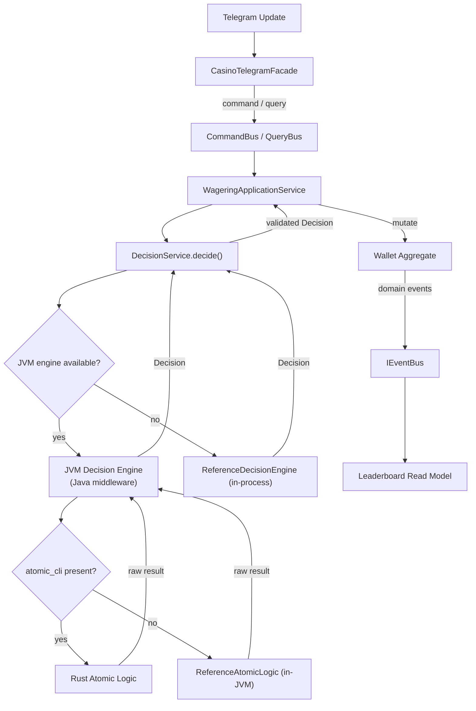

# boom-bot JVM Decision Engine

This is the decision fabric for the boom-bot casino platform. It sits between
the Python orchestrator and the pure atomic-logic layer so that the PURE
business logic of a *decision* (the house's choice about what the wheel lands
on, what the dice show, what the Zeus reels reveal) is delegated away from the
application service and rendered by a dedicated engine.

## Architecture

```
┌─────────────────────────────────────────────────────────────────────────┐
│  Python orchestrator (boombot.casino)                                   │
│    builds a DecisionRequest: {kind, seed, tenant, context}              │
│    emits it as one JSON line on the engine's stdin                      │
└───────────────────────────────────┬─────────────────────────────────────┘
                                    │ JSON-lines subprocess
                                    ▼
┌─────────────────────────────────────────────────────────────────────────┐
│  JVM Decision Engine  (this directory, Java middleware)                 │
│    normalises the request into a DecisionKind + numeric seed            │
│    selects the DecisionStrategy for the game family (the rules live     │
│      here, in the JVM -- that is the "business logic" layer)            │
│    asks the atomic-logic port for a raw result                          │
└───────────────────────────────────┬─────────────────────────────────────┘
                                    │ spawns atomic_cli per decision
                                    ▼
┌─────────────────────────────────────────────────────────────────────────┐
│  Rust Atomic Logic  (rust-atomic-logic/, PURE atomic logic)             │
│    splitmix64 seed mixer + uniform primitives only                      │
│    atomic_spin_roulette / atomic_roll_craps / atomic_zeus_grid          │
│    zero I/O, zero ambient randomness, referentially transparent         │
└─────────────────────────────────────────────────────────────────────────┘
```

## Decision flow



The control flow above is elaborated for scale in
[`SCALING.md`](SCALING.md), including the regionally distributed deployment
topology and the extensibility model.

The protocol is line-delimited JSON over a spawned subprocess, the same shape
as boom-bot's existing UCI Stockfish integration. One decision = one short-lived
`atomic_cli` process.
The protocol is line-delimited JSON over a spawned subprocess, the same shape
as boom-bot's existing UCI Stockfish integration. One decision = one short-lived
`atomic_cli` process.

## Reference implementation

The decision fabric guarantees that a decision is always rendered even when the
JVM engine is unavailable (the jar is not built, the Java runtime is absent, or
the subprocess fails). In that case the fabric degrades to an in-process
reference provider which renders the same output shape and the same
uniform odds as the JVM/Rust path, so the application layer never blocks on a
hardware or toolchain dependency. The house edge is defined by the payout
tables, not by the decision engine.

## Building

Requirements: a JDK 17+ and, for the Rust path, a Rust toolchain. The Java step
is mandatory and offline (`javac` + `jar`); the Rust step is optional and the
engine will happily degrade to its in-JVM reference provider if `cargo` is
absent.

```bash
./build.sh
```

Artifacts:

```
build/jvm-decision-engine.jar   # the JVM decision engine (Java middleware)
build/atomic_cli                # the Rust atomic-logic binary (if cargo present)
```

## Running

Feed it one JSON request per line on stdin; it replies with one JSON response
per line on stdout:

```bash
./run-decision-engine.sh <<'EOF'
{"id":"r1","kind":"ROULETTE_SPIN","seed":"a1b2c3","context":{"tenant":"ch1"}}
{"id":"c1","kind":"CRAPS_ROLL","seed":"deadbeef"}
EOF
```

The `run-decision-engine.sh` wrapper sets `DECISION_ENGINE_RUST_BIN` for the
child process; use it rather than invoking `java -jar` directly.

## Configuration

| Env var | Meaning | Default |
| --- | --- | --- |
| `DECISION_ENGINE_RUST_BIN` | path to the compiled `atomic_cli` | `build/atomic_cli` |
| `DECISION_ENGINE_TIMEOUT_SECONDS` | per-decision child timeout | `5` |