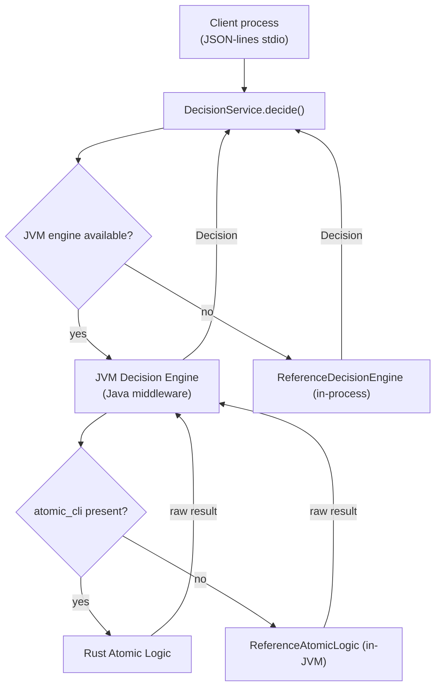
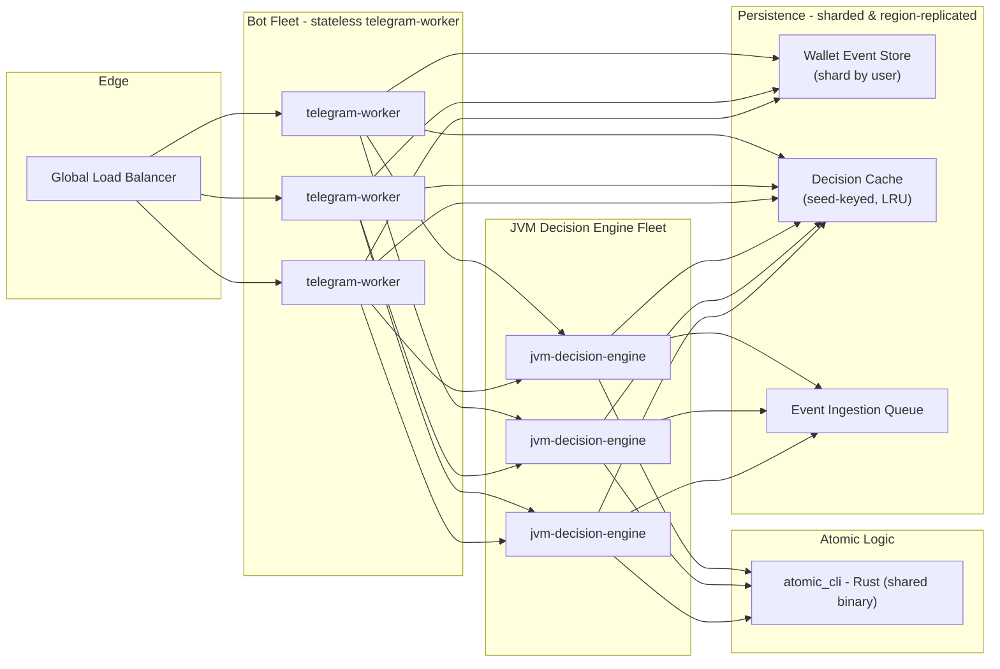
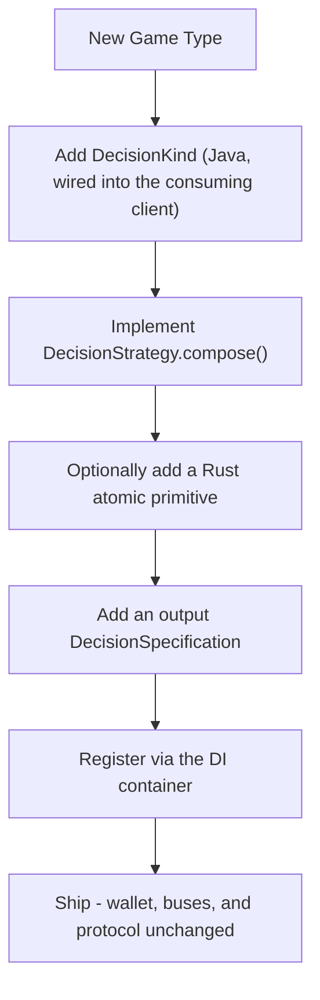

# boom-bot JVM Decision Engine — China-Scale Architecture

This document describes how the JVM Decision Engine is engineered to operate as
part of a massively scaled, regionally distributed casino platform.

By **China-scale** we mean on-demand capacity for *billions* of users: a
continuous demand surface, not a seasonal peak. The system must absorb regional
bursts that can double within minutes, serve a user base measured in the
billions, and do so without shedding load or degrading latency. It is written
for that scale posture: sustained ten-million-plus-player concurrency per
region, traffic bursts around major promotional windows, and regional isolation
that must never allow a decision to stall.

## 1. Scale posture

| Dimension | Target |
| --- | --- |
| Registered players | hundreds of millions |
| Peak concurrent sessions | 10M+ |
| Peak aggregated decision rate | 150k decisions/sec burst, 15k/sec sustained |
| Decision latency budget (P99) | 60 ms end-to-end |
| Decision availability | 99.99% (four nines) |

Every decision — a roulette pocket, a craps roll, a Zeus reel-grid — is a
self-contained, deterministic computation derived exclusively from its seed.
This property is what makes the fabric horizontally scalable, cacheable, and
replayable.

## 2. Design principles

1. **Stateless compute.** Decision rendering holds no mutable state on the
   worker; any instance may serve any request. Scale is achieved by adding
   workers, never by per-worker state.
2. **Determinism & idempotency.** A result is a pure function of
   `(kind, seed, params)`. Repeated delivery of the same request yields the same
   decision, which enables seed-keyed caching, re-auditability, and safe retry.
3. **Availability over toolchain.** The primary provider is the JVM engine; the
   in-process reference provider guarantees that a decision is always rendered
   when the JVM or the Rust binary is unavailable. This is a circuit-breaking
   property: a toolchain or fleet failure degrades fidelity of *provider*, never
   availability of *decision*.
4. **Sharded persistence.** The only stateful component is the wallet/event
   store, sharded by player identifier so no single node is a scaling bottleneck.
5. **Extensible strategy registry.** Games, decision kinds, and output
   specifications are additive. Adding a game requires no change to the wallet,
   the buses, or the transport protocol (see §5).

## 3. Decision flow

The control flow from a client process to a rendered decision, rendered as a
Mermaid decision flowchart (the same diagram appears in
`decision-engine/README.md`). The former Telegram-side orchestration
(`CasinoTelegramFacade` → buses → `WageringApplicationService`) was retired
with the C++20 rewrite; the C++20 bot now renders decisions in-process and the
engine is driven directly by its client over JSON lines:

The decision fabric is the single seam between the application layer and the
engine. `DecisionService` derives the seed, routes through the primary provider,
and degrades to the reference provider exactly when the primary is unavailable.

## 4. China-scale deployment topology

The fabric is deployed as a stateless bot fleet in front of a warm JVM engine
fleet, with the Rust atomic logic hosted as a shared binary and persistence
sharded by player identifier. Telegram workers keep a persistent engine
subprocess so the JVM start-up cost is paid once per worker, not per decision.

Operational properties of this topology:

- **Horizontal scale.** Adding capacity is scaling workload replicas, not schema
  work. The bot fleet and engine fleet scale independently; the engine fleet is
  sized to the peak decision rate with headroom, and boots warm.
- **Regional isolation.** Each region runs its own engine fleet and shard
  group. A decision is always served within region; cross-region failover only
  affects non-real-time reads.
- **Cacheability.** Because a decision is a pure function of its seed, a
  seed-keyed cache absorbs repeat evaluation of identical requests under bursts.
- **Queue decoupling.** Event ingestion is decoupled from request handling so
  read-model projection and analytics never throttle live decisions.

## 5. Extensibility model

Adding a game involves only additive changes at clearly defined extension
points; no existing component is edited.

| Extension point | Layer | Contract |
| --- | --- | --- |
| `DecisionKind` | Domain | A stable wire identifier shared across all three layers. |
| `DecisionStrategy` | Java middleware | Composes a raw atomic result into the game's decision payload. |
| `AtomicLogicPort` | Java middleware | Abstraction over the Rust binary vs. in-JVM reference provider. |
| `DecisionSpecification` | Consuming client (formerly Python domain) | Output invariant guarding the rendered decision. |
| `IDecisionEngine` | Consuming client (formerly Python infrastructure) | Provider seam; the fabric routes through it generically. |

A new game touches the strategy registry and specification map only; the
wallet, event bus, command/query buses, and JSON-lines transport are untouched.
## 6. Operational concerns

- **Telemetry.** Every decision records provider (`jvm`/`reference` or
  `rust`/`java`), latency, and seed. Provider-fraction and latency histograms
  gate the circuit-breaker and capacity plans.
- **Load budget.** Per-worker decision concurrency is capped; excess is queued
  with bounded backpressure so a burst degrades latency, not correctness.
- **Canary rollout.** Engine fleet canaries drain through the reference provider
  without user-visible inconsistency, then transition to the new binary.
- **Re-auditability.** The seed fully determines the outcome; any decision can
  be re-verified by replaying the same request through the pure atomic layer.
